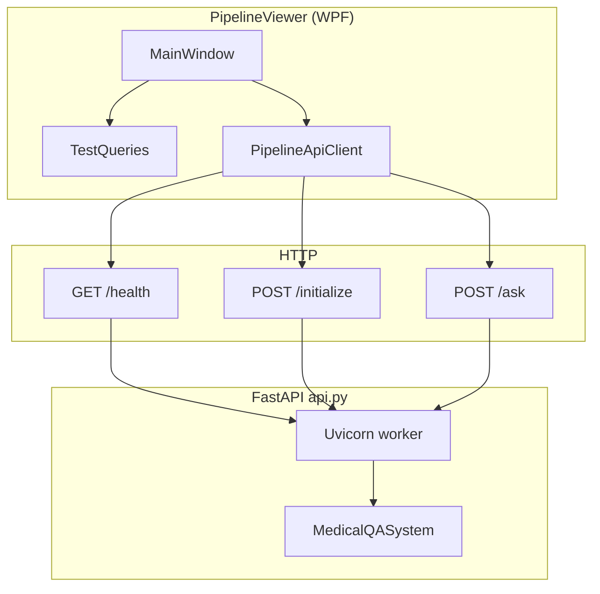

# Pipeline Viewer — architecture

Windows desktop client for the **SafeAI Clinical Pipeline** FastAPI service (`api.py` at the repository root). The app does not embed the Python pipeline; it is a **thin HTTP client** plus **preset/query catalog** aligned with the evaluation scripts.

---

## Technology stack

| Layer | Choice |
|--------|--------|
| UI | **WPF** (.NET 8, `UseWPF`) |
| HTTP | **`HttpClient`** (singleton per process) |
| Serialization | **System.Text.Json** (`JsonPropertyName` for snake_case API bodies) |
| Target | **`net8.0-windows`** |

---

## Repository layout

```
windows/PipelineViewer/
  PipelineViewer.sln          # Visual Studio / MSBuild entry
  pipelineviewer.md           # This document
  README.md                   # Run instructions, PowerShell/curl notes, local Qwen env
  set_local_qwen_env.ps1      # Optional: dot-source before uvicorn (repo root)
  PipelineViewer/
    PipelineViewer.csproj
    App.xaml / App.xaml.cs    # WPF application bootstrap
    MainWindow.xaml(.cs)      # Main UI + event handlers
    PipelineApiClient.cs      # Typed HTTP calls to FastAPI
    TestQueries.cs            # 25 + 25 strings (WHO / Uganda) from Python scripts
```

Build output under `PipelineViewer/bin` and `obj` is ignored by git (see repo `.gitignore`).

---

## Logical architecture



- **TestQueries** is static data only (no I/O).
- **PipelineApiClient** is stateless aside from the shared `HttpClient`; all methods are async and take a base `Uri`.
- **MainWindow** owns UI state, `async void` click handlers (WPF pattern), and formats JSON for the results pane.

---

## UI module map (`MainWindow`)

| Control / area | Responsibility |
|------------------|----------------|
| `BaseUrlBox` | API root (e.g. `http://127.0.0.1:8000`) |
| `SourceCombo` | Preset selection → `who-malaria` or `uganda` for `/initialize` |
| `ReuseKbCheck` | Maps to `reuse_existing_kb` on `/initialize` |
| `InitButton` | `POST /initialize` |
| `HealthButton` | `GET /health`; refreshes local-LLM status line |
| `QueryCombo` | One of 25 test strings per source; `QueryOption.Caption` + tooltip full text |
| `UseLocalQwenCheck` | When checked, `POST /ask` includes `use_local_llm: true` |
| `LocalLlmStatusText` | Parsed from `/health`: `local_llm_gguf_configured`, `local_llm_env_enabled` |
| `AskButton` | `POST /ask` with selected query + `full_response: true` |
| `ResultBox` | Pretty-printed JSON (`PipelineApiClient.TryFormatJson`) |

**Busy state:** while a request runs, primary controls are disabled and the wait cursor is shown.

---

## HTTP client (`PipelineApiClient`)

| Method | Route | Request body (JSON keys) |
|--------|-------|----------------------------|
| `HealthAsync` | `GET /health` | — |
| `InitializeAsync` | `POST /initialize` | `preset`, `reuse_existing_kb` |
| `AskAsync` | `POST /ask` | `query`, `full_response`, optional `use_local_llm` |

Snake_case property names match Pydantic/FastAPI. `use_local_llm` is omitted when `null` (`DefaultIgnoreCondition = WhenWritingNull`) so the server can follow environment defaults.

---

## Data flow

### 1. Initialize index

1. User picks **source** → preset string (`TestQueries.WhoMalariaPreset` / `UgandaPreset`).
2. **Create index** → `InitializeAsync(baseUri, preset, reuseKb)`.
3. Response JSON shown in `ResultBox`; status line reflects HTTP outcome.
4. Server loads or builds the KB; client does not hold pipeline state.

### 2. Ask (full response)

1. User picks a **test query** from `QueryCombo` (list rebuilt when source changes).
2. **Run query** → `AskAsync(..., useLocalLlm: checkbox)`.
3. Response includes `result` with `vht_response`, `query_intent`, optional `local_llm_used`, etc.
4. JSON is formatted for readability only; the client does not parse clinical fields for display beyond raw JSON.

### 3. Health + local LLM hint

1. **Health** fetches `/health`.
2. `ApplyLocalLlmStatusFromHealthJson` reads boolean flags and updates `LocalLlmStatusText` so the operator knows whether the **server process** sees a GGUF path and env toggle.

---

## Concurrency and lifecycle

- **`HttpClient`** is `static readonly` with a long timeout (minutes) to tolerate slow `/initialize` and local LLM `/ask` on CPU.
- **Async:** `ConfigureAwait(true)` in handlers so UI updates stay on the WPF dispatcher context.
- **No** background pipeline work in the desktop process; all heavy work is server-side.

---

## Coupling to the Python repo

| Client concept | Server / scripts |
|----------------|------------------|
| Preset strings | `api.py` `_PRESET_ALIASES` / `InitializeRequest.preset` |
| Query list | `scripts/who_malaria_pipeline_report.py` — `MALARIA_SEARCH_QUERIES`, `UGANDA_SEARCH_QUERIES` |
| Local Qwen | `SAFEAI_LLM_GGUF`, `SAFEAI_USE_LOCAL_LLM`, `POST /ask` `use_local_llm` |

If the Python side renames endpoints or bodies, update **`PipelineApiClient`** and any **README / pipelineviewer** references.

---

## Extension ideas (not implemented)

- Persist last **base URL** and checkbox states in user settings.
- Parse `result` JSON into tabs (evidence vs VHT vs structured) instead of one text box.
- Optional **OpenAPI**-generated client instead of hand-written DTOs.
- **CancellationTokenSource** per request for Cancel button.

---

## Related documentation

- **`README.md`** (same folder) — prerequisites, `dotnet run`, PowerShell examples, local Qwen env for the **API host**.
- **`pipeline/README.md`** — full medical pipeline and HTTP API semantics.
